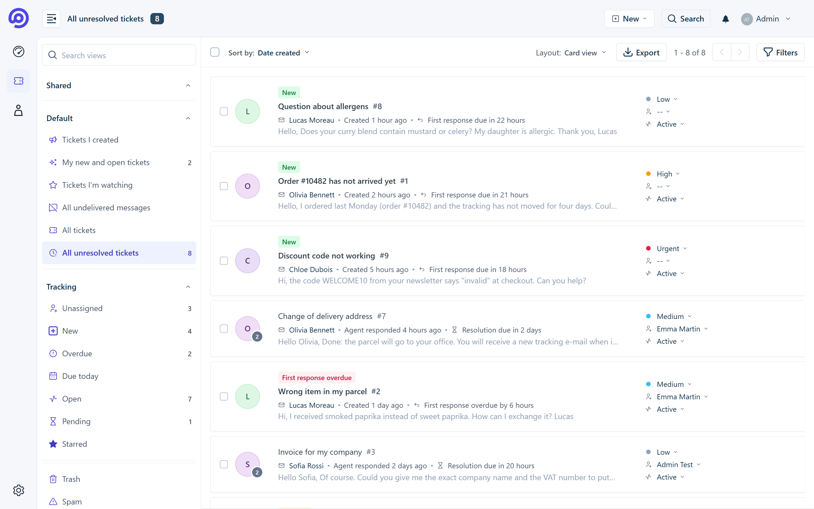
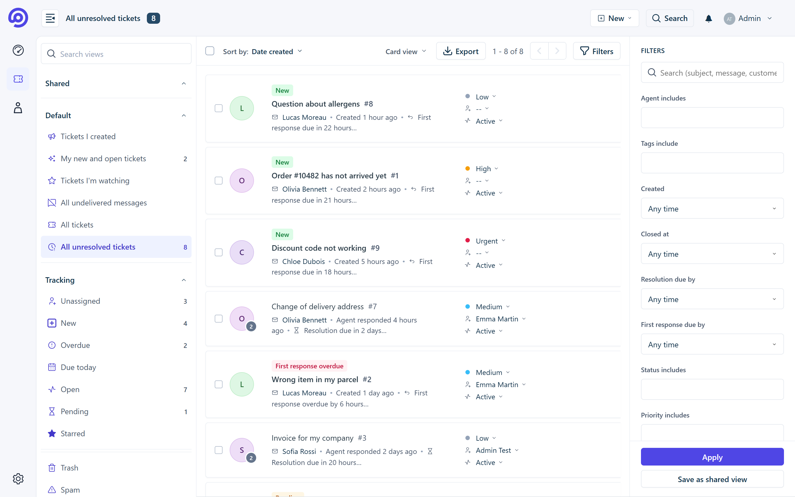
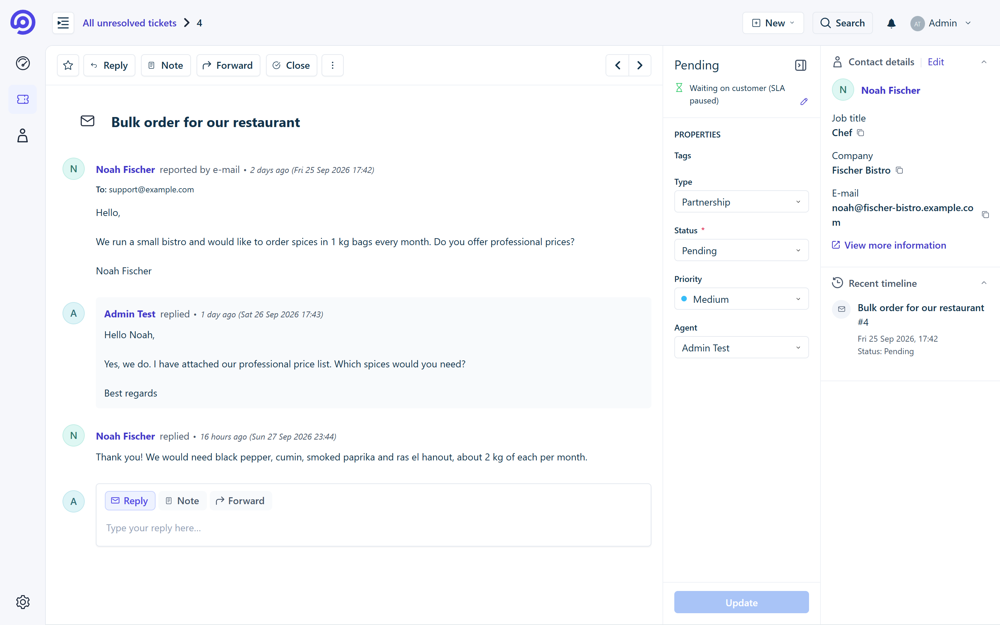
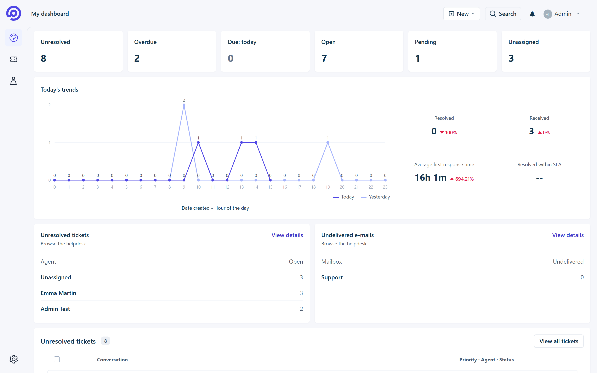
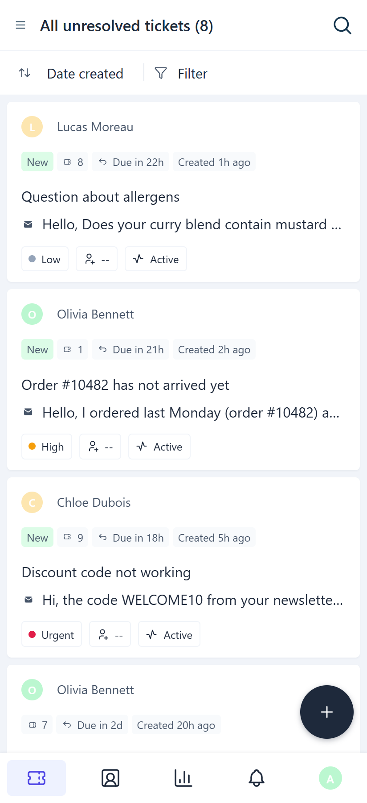
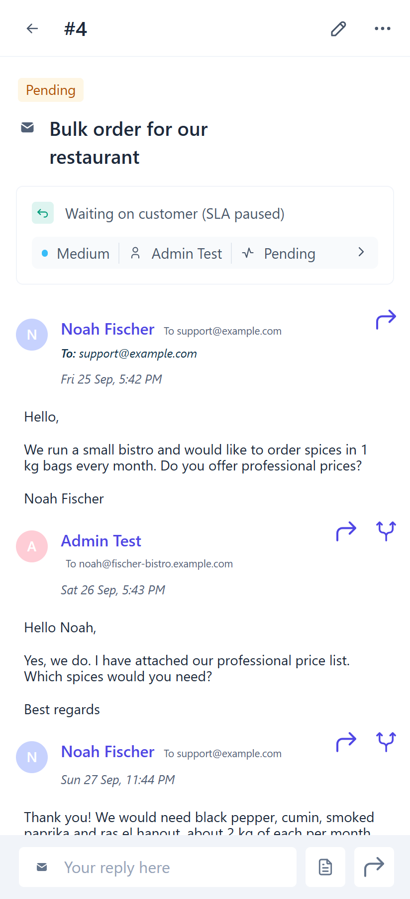
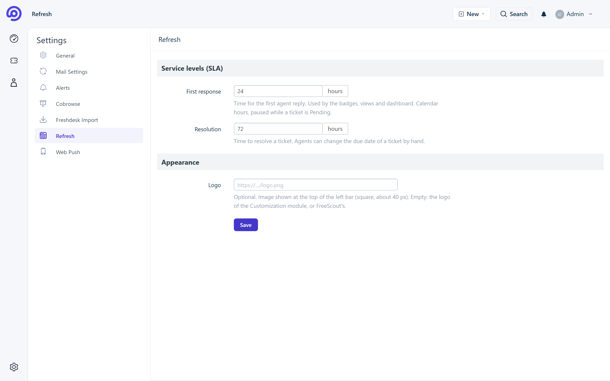

# Refresh: a new interface for FreeScout

**A new, Freshdesk-inspired interface for [FreeScout](https://freescout.net).** Refresh reworks the whole agent interface
of FreeScout: a left navigation bar, ticket views with SLA badges, a dashboard, a properties panel next to each ticket,
a Freshdesk-style reply editor, ajax actions everywhere and a phone version.
It borrows Freshdesk's ergonomics, with a look of its own (slate and indigo, light borders, small radii), also applied
to FreeScout's own pages: settings, profiles, customers, users, mailboxes and modules.

It is a single module: no core file is modified, nothing depends on the Customization module, and switching it off
brings the stock FreeScout interface back.



## Companion modules

- **Installable app and push notifications on phones**: [Web Push](https://github.com/altmenorg/freescout-webpush).
- **Helping customers on screen** (co-browsing from the ticket): [Cobrowse](https://github.com/altmenorg/freescout-cobrowse).
- **Moving from Freshdesk** with your whole history: [Freshdesk Import](https://github.com/altmenorg/freescout-freshdesk-import).
- **AI-drafted replies** in the editor: [Claude Assistant](https://github.com/altmenorg/freescout-claude-assistant).

## Features

### Navigation
- **Left bar** with icons: Dashboard, Tickets, Contacts, Saved replies, Tags (when the Tags module is active), plus the
  entries of other modules (see [For module developers](#for-module-developers)). Your logo on top.
- **Views panel**: switching views, filters, sorting and pages happens in place (ajax), with browser history support.
- **Search** in the top bar with instant suggestions; Enter searches all tickets.

### Ticket list
- **Views**, in the same order as Freshdesk: tickets I created, my new and open tickets, tickets I'm watching,
  undelivered messages, all tickets, all unresolved tickets; then unassigned, new, overdue, due today, open, pending,
  starred; trash and spam. Live counters.
- **Saved views**: save the current filters as a shared view.
- **Filters panel**: agents, statuses, priorities, types, tags, customer, created / closed period, resolution and first
  response due dates. **Sort** by date created, last modified, last customer response, due date, priority or status.
- **Card layout** with SLA badges (*New*, *First response overdue*, *Overdue*, *Customer responded*, *Pending*),
  a status line ("Customer responded 2 hours ago • Resolution due in 5 hours"), and priority / agent / status
  drop-downs you can change right from the list.
- **Bulk actions** bar (assign, status, tags, merge, delete) and **CSV export** of the current view.
- FreeScout's own folder pages (Unassigned, Mine, Starred…) open your last view. After closing a ticket, the next one
  is the one that followed in your view, with its filters and sort.



### Ticket
- Freshdesk-like **conversation**: "Name replied • 3 days ago (Mon 21 Sep 2026 13:43)", round avatars, notes in yellow,
  quoted history folded behind a "•••" button.
- **Properties panel** on the right: type, status, priority, agent, tags, resolution due date (editable), SLA summary,
  customer details and the customer's recent tickets. **Update** saves in place; closing a ticket takes you to the
  next one.
- **Reply editor** restyled after Freshdesk: tabs Reply / Note / Forward, recipients as chips, formatting toolbar,
  canned responses, attachments, drafts with edit / discard icons, and a send button with "Send and set as Pending /
  Closed / Open".
- **Toolbar**: reply, note, forward, close / reopen (ajax), star, merge, print, delete.
- **Split ticket**: move a message to a new ticket, with a note left in the original one.
- **Inline tags** field with suggestions and "Create …" (Tags module).
- **Toasts** instead of the green banners, with close button, "View" and "Undo".



### New ticket and new e-mail
The **New** menu of the top bar offers the two Freshdesk pages, with the contact panel on the right:
- **Ticket**: create a ticket on behalf of a contact (a call, a chat…). The description is the contact's message and
  nothing is sent to them. Contact search or a new contact, Cc, type, status, priority, agent, tags; "Create and set
  as closed" and "Create another".
- **E-mail**: write to a contact; they get the e-mail and a ticket comes with it. To, Cc, Bcc, priority, status, type,
  tags; "Send another".
No empty draft is saved when these pages open.

### Dashboard and contacts
- **Dashboard**: tiles (unresolved, overdue, due today, open, pending, unassigned), today's figures compared with
  yesterday (received, resolved, average first response time, resolved within SLA), unresolved tickets per agent,
  undelivered e-mails, tickets created per hour of the day.
- **Contacts** page: searchable list of customers with their phones, links to their tickets, CSV export.



### Phone version
- **Phone version** (under 768 px), modelled on the Freshdesk Android app: title bar, views drawer, sort and filter
  sheets, ticket cards, infinite scroll, long press to select, bottom tab bar, full-screen editor and properties.
- **Installable app and push notifications**: they moved to a separate module,
  [Web Push](https://github.com/altmenorg/freescout-webpush), which also works without Refresh. With both modules, the
  installed app opens on the phone version and the notifications prompt sits above its tab bar.

<p>
  
  &nbsp;
  
</p>

### Languages
English and French. Other languages can be added with a `Resources/lang/<locale>.json` file (English key =>
translation), plus `Resources/lang/<locale>/labels.php` for the few words FreeScout translates with another meaning,
and optionally `Resources/lang/overrides/<locale>.php` to reword FreeScout's own strings (the French file turns
"conversation" into "ticket", like Freshdesk).

## Requirements

- FreeScout 1.8 or newer.
- Tested with the Tags module; the Freshdesk-style *Type* and *Priority* fields are stored in the conversation data and
  filled by the [Freshdesk Import](https://github.com/altmenorg/freescout-freshdesk-import) module.

## Installation

1. Download [`Refresh.zip`](https://github.com/altmenorg/freescout-refresh/releases/latest/download/Refresh.zip) from the latest release and unzip it into the `Modules` folder of FreeScout: you get `Modules/Refresh`
   (the folder **must** have this name).
2. In FreeScout, **Manage › Modules**: activate **Refresh**.
3. Optional: **Manage › Settings › Refresh** to set your SLA and logo.
4. Optional: install [Web Push](https://github.com/altmenorg/freescout-webpush) for the installable app and push
   notifications.

To go back to the stock interface, deactivate the module. Its settings are kept.

**Upgrading from Modern UI 1.x** (this module's former name): deactivate Modern UI, delete `Modules/ModernUi`, install
Refresh as above. Its settings and shared views are taken over automatically.

**Upgrading from Refresh 1.2 or older with push notifications in use:** install
[Web Push](https://github.com/altmenorg/freescout-webpush) along with Refresh 1.3. It takes over the app settings, the
server keys and the subscribed devices: nobody has to subscribe again.

**Updates:** from version 1.3.8, FreeScout tells you in **Manage › Modules** when a new version is out, and the **Update** button installs it in one click. From an older version, update once by hand as above.

## Settings

**Manage › Settings › Refresh**

| Setting | |
|---|---|
| **First response** | Hours to the first agent reply (default 24). Used by badges, views and the dashboard. Calendar hours, paused while a ticket is *Pending*. |
| **Resolution** | Hours to resolve a ticket (default 72). The due date of a ticket can also be changed by hand. |
| **Logo** | Image shown at the top of the left bar. Empty: the header logo (Customization module or FreeScout's own). |



## For module developers

Other modules can add an entry with their own icon to the left bar:

```php
\Eventy::addFilter('refresh.rail_items', function ($items) {
    $items[] = [
        'url'    => route('mymodule.page'),
        'label'  => __('My module'),
        'icon'   => asset(\Module::getPublicPath('mymodule').'/icons/mymodule.svg'), // SVG, drawn in the bar's color
        'active' => \Route::is('mymodule.*'),
        'order'  => 500, // optional, default 100
    ];
    return $items;
});
```

Links a module adds to FreeScout's top menu also appear in the bar, with a generic icon, when they are not declared
this way. The [Cobrowse module](https://github.com/altmenorg/freescout-cobrowse) is an example.

## Other modules from the Refresh project

Modules built alongside Refresh. Each one also works with FreeScout's stock interface.

- **[Web Push](https://github.com/altmenorg/freescout-webpush)**: install FreeScout as an app on phones and desktops, with end-to-end encrypted Web Push notifications.
- **[Cobrowse](https://github.com/altmenorg/freescout-cobrowse)**: co-browse with your customers (Cobrowse.io) from the ticket sidebar, to guide them on your website or app.
- **[Freshdesk Import](https://github.com/altmenorg/freescout-freshdesk-import)**: import your Freshdesk tickets into FreeScout and keep them in sync until you switch over.
- **[Claude Assistant](https://github.com/altmenorg/freescout-claude-assistant)**: draft and improve replies with Claude, from the reply editor.

## Credits

Icons: [Crayons](https://github.com/freshworks/crayons) (MIT), [Tabler Icons](https://tabler.io/icons) (MIT) and
[Lucide](https://lucide.dev) (ISC, partly derived from Feather, MIT). Full notices in
[THIRD-PARTY-NOTICES.md](THIRD-PARTY-NOTICES.md). No fonts are bundled.

Refresh is not affiliated with or endorsed by Freshworks. "Freshdesk" is a trademark of Freshworks Inc., used here
only to describe the look the interface is inspired by.

## License

[GNU AGPL v3](LICENSE), like FreeScout.
